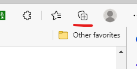
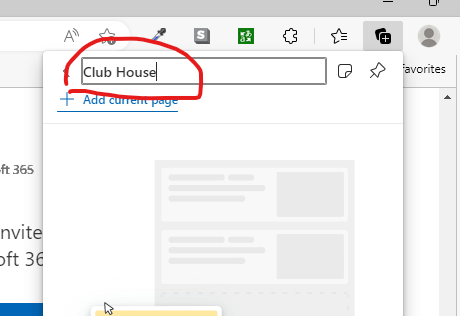
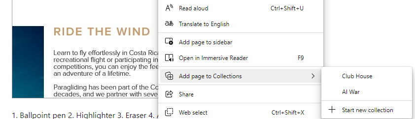
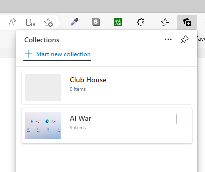

ابتدا در قسمت بالا سمت راست آیکون collections

را کلیک میکنیم.

سپس Start new collection را انتخاب میکنیم و برای مجموعه جدید

یک نام (مثلا club house) ثبت میکنیم

از این به بعد روی هر صفحه که باشیم با کلیک راست و انتخاب
Add page to Collections

صفحه مورد نظر را به آن مجموعه اضافه میکنیم.

از این به بعد هر زمان که در قسمت Collections روی یکی از مجموعه هایی
که قبلا ساختیم کلیک کنیم تمام صفحات اضافه شده به آن مجموعه باز و بروز میشود

